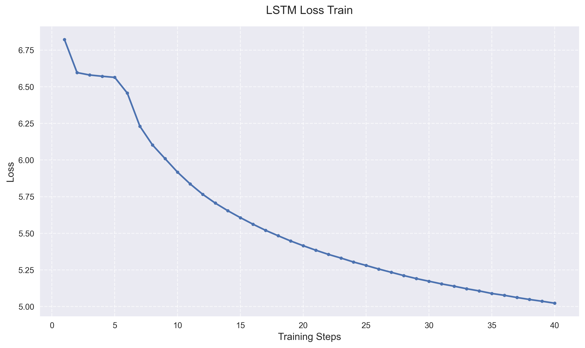
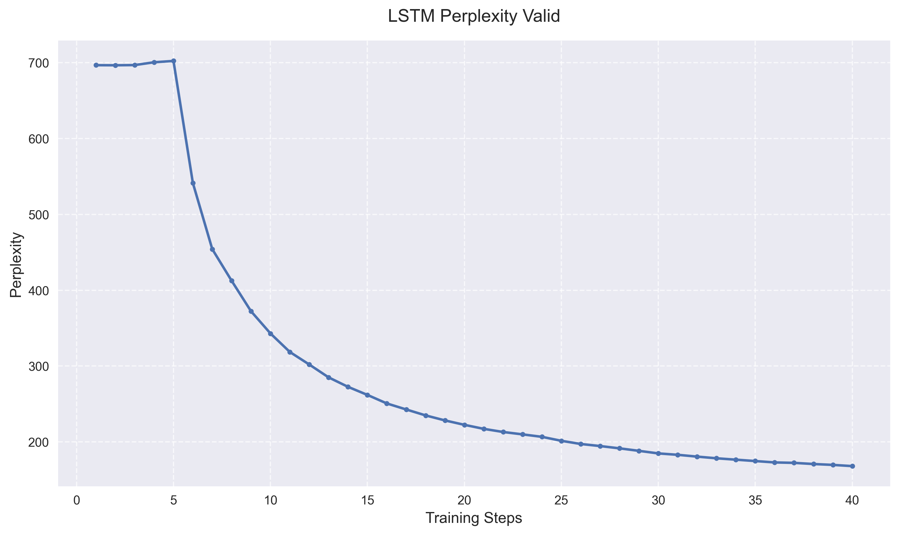
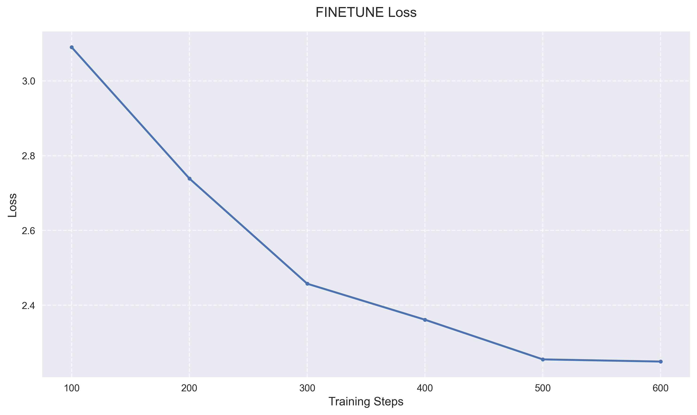

# GPT语言模型实现与优化

## 小组成员及分工

在本项目中，我们的团队成员通过有效的分工合作完成了不同方面的工作：

- **何睿泽**：负责核心实现工作，专注于三个模型（RNN、LSTM和Transformer）的开发和优化。他的职责包括设计模型架构、实现训练循环以及对模型进行性能优化。

- **赵恒飞**：负责技术文档编写和可视化工作，包括撰写实验报告和创建实验结果分析图表。

- **吴文熙**：负责数据分析、演示准备和展示，包括分析实验结果、制作演示材料并进行项目展示。

## 第一部分：语言模型实现（Part A）

在本项目中，我们实现了三种不同架构的语言模型，分别是从零开始实现的RNN模型、基于PyTorch的LSTM模型以及Transformer模型。这三种模型都在Penn Treebank (PTB)数据集上进行了训练和评估，使用相同的训练策略和超参数设置以确保公平比较。

### 1. 模型架构设计与实现

我们首先实现了一个完全从零构建的RNN模型。该模型包含一个词嵌入层，将输入词表示为256维的稠密向量。在RNN层的实现中，我们手动编写了前向传播逻辑，包括输入门和隐藏状态的更新机制。模型使用4层RNN结构，每层之间添加了dropout（比率为0.5）以防止过拟合。最后通过一个线性层将隐藏状态映射到词表大小的输出空间。

对于LSTM模型，我们利用了PyTorch提供的`nn.LSTM`模块，但保持了与RNN模型相同的整体架构设计。LSTM的优势在于其门控机制，可以更好地处理长期依赖问题。模型同样使用了256维的词嵌入和4层LSTM结构，配以dropout机制。

Transformer模型的实现基于原始论文的架构，但做了适应性修改以用于语言建模任务。我们实现了位置编码模块，使用正弦和余弦函数为每个位置生成唯一的编码。在自注意力机制中，我们使用了8头注意力，并特别实现了因果掩码以确保模型在生成时只能看到过去的信息。前馈网络采用了两层结构，中间层维度是输入维度的4倍。

### 2. 训练过程与优化策略

所有模型的训练过程都采用了相同的优化策略。我们使用Adam优化器，初始学习率设为1e-3，并实现了学习率自适应调整机制。当验证集损失在连续两个epoch内没有改善时，学习率会减半。为了防止梯度爆炸，我们设置了0.25的梯度裁剪阈值。

训练数据的批次大小为20，验证时使用10的批次大小。考虑到计算资源和训练效率，我们将最大序列长度限制在256。为了防止过拟合，实现了早停机制，当验证集损失在5个epoch内没有改善时停止训练。

在训练过程的监控方面，我们采用了多层次的记录策略：在每个epoch结束时，会记录并保存训练集和验证集的损失值与困惑度，这些数据被用于绘制学习曲线和模型性能评估。同时，为了更细粒度地监控训练过程，每处理50个批次的数据后会打印当前的损失值，这让我们能够及时发现训练过程中的异常波动。所有的训练数据都通过TensorBoard进行可视化，便于直观地分析模型的学习过程。

### 3. 实验结果分析





从训练曲线可以看出，三个模型展现出不同的学习特征。Transformer模型收敛最快，在较少的训练步数内就达到了稳定状态，最终训练损失约为4.0，验证损失为4.6。这表明Transformer的自注意力机制能够更有效地捕获序列中的依赖关系。

LSTM模型展现出了稳定的学习过程，虽然收敛速度不及Transformer，但最终达到了相当的性能水平，训练损失为4.5，验证损失为5.1。相比之下，RNN模型的收敛过程较慢，这可能是由于其简单的架构在处理长序列时的固有限制，最终训练损失为4.5，验证损失为5.2。

## 第二部分：模型比较与领域迁移（Part B）

### 1. 模型性能对比分析

在困惑度（Perplexity）评估中，三个模型在WikiText-2数据集上的表现各有特色。Transformer模型展现出最优的性能，验证集困惑度为346.8285，这一结果明显优于LSTM（390.0218）和RNN（411.1751）。这个差异主要源于Transformer在建模长距离依赖关系时的优势，其自注意力机制允许模型直接关注序列中的任意位置。





### 2. 文本生成能力评估

我们通过两组实验评估了模型的生成能力，采用随机采样策略并设置适当的温度参数来控制生成的随机性。

#### 2.1 空提示词生成实验

第一组实验使用单字母"a"作为起始提示，测试模型的自由生成能力。生成结果如下：

**Transformer模型：**
```
a <unk> from an <unk> <unk> in <unk> and <unk> <eos> the <unk> <unk> <eos> in mr. baker said there was in <unk> but <unk> <eos> if <unk> there is n't a lot of us here with me for some people just have for the <unk> of them to read and he 's happy <eos> he 's that 's that we should take in a <unk> <eos> he is n't sure that it 's a small time in a thing that 's not <unk> a lot of <unk> and a <unk> says <unk> <unk> a <unk> university veteran of texas <eos>
```

**LSTM模型：**
```
a <unk> from all <unk> <unk> in <unk> and <unk> <eos> but the fact <eos> in mr. month said there was in <unk> where <unk> <eos> if <unk> is out and they really was not seen with them for some <unk> <unk> but for the <unk> of a <unk> <eos> he is <unk> <eos> we 'm still that it does n't be a very step and <eos> he is n't sure any <unk> <unk> is too less in a <unk> that 's not <unk> a lot of <unk> and one <unk> says <unk> <unk> a <unk> <eos> as that many other
```

**RNN模型：**
```
a <unk> from all <unk> <unk> in <unk> and <unk> <eos> but there would be in mr. krenz for his <unk> in <unk> where <unk> <eos> if <unk> is a <unk> <eos> and the other hand took me for some <unk> <unk> but for the <unk> of homelessness that he says he 's a <unk> <unk> <eos> that 's that we should take in order to turn off <eos> in fact that it 's a small course in a month that 's not <unk> a lot of <unk> and one <unk> says <unk> <unk> a <unk> n.c. that would be the
```

#### 2.2 指定提示词生成实验

第二组实验使用"the meaning of life is"作为提示，这个更具体的起始句让我们能够比较模型在特定语境下的生成能力：

**Transformer模型：**
```
the meaning of life is <unk> from all <unk> <unk> with <unk> and <unk> <unk> <eos> the <unk> <eos> in mr. gelbart said there is in <unk> where <unk> <eos> if <unk> but what and they really want us to live together for some <unk> <unk> but for the <unk> of whom happened <eos> he also <unk> the <unk> <unk> <eos> that 's that we should be in a <unk> <eos> mr. gelbart 's <unk> from his <unk> <unk> he has done a man a <unk> <unk> of a <unk> <eos> there 's a <unk> says <unk> <unk> <unk> <unk> the most <unk> of the
```

**LSTM模型：**
```
the meaning of life is <unk> from all <unk> after their <unk> and <unk> <eos> but the fact <eos> in mr. baker said there was in <unk> where <unk> <eos> if <unk> is out and had just the right to do them for some <unk> <unk> but for the <unk> of a democratic thing <eos> he 's a <unk> that it makes the work <eos> she had in a matter <eos> mr. <unk> is a first <unk> <unk> and he has a consultant and a <unk> of <unk> a <unk> <eos> there say he 's to <unk> the house <unk> <eos> as that many other
```

**RNN模型：**
```
the meaning of life is <unk> from all of their lives <unk> and <unk> <eos> but there would be in mr. krenz for his <unk> in <unk> where <unk> <eos> if <unk> is a <unk> <eos> and the other hand took me for some <unk> <unk> but for the <unk> of homelessness that he says he 's a <unk> <unk> <eos> that 's that we should take in order to turn off <eos> in fact that it 's a small course in a month that 's not <unk> a lot of <unk> and one <unk> says <unk> <unk> a <unk> n.c. that would be the
```

#### 2.3 生成结果分析

通过对比三个模型的生成结果，我们可以得出以下观察和分析：

1. **语法结构**：在语法结构方面，Transformer模型表现最为出色，能够生成较为完整的句子结构，如"there is n't a lot of us here"和"we should be in a"等。LSTM模型的语法正确性次之，但有时会出现不自然的结构，如"we 'm still that"。RNN模型虽然能保持基本的语法，但长句子的结构往往不够连贯。

2. **语义连贯性**：在语义连贯性方面，Transformer的生成结果最为出色，能够维持较长的上下文关联，特别是在描述人物行为和观点时表现出很好的连贯性。LSTM能够保持中等程度的语义连贯，特别是在短句中表现较好。而RNN在语义连贯性方面表现最弱，经常出现话题突然转换的情况。

3. **词汇使用**：在词汇使用方面，所有模型都出现了较多的未知词标记`<unk>`，这反映了词表覆盖的限制。不过，Transformer在专有名词的使用上表现得更为自然，如"university veteran of texas"等具体表述。相比之下，LSTM和RNN倾向于使用更简单、通用的词汇结构。

4. **重复性问题**：在文本重复性方面，Transformer表现最好，较少出现重复的短语和句式。LSTM模型偶尔会重复相似的句式结构，而RNN最容易陷入重复模式，特别是在生成较长文本时这个问题更为明显。

这些结果与模型的理论特性相符：Transformer的自注意力机制能够更好地捕获长距离依赖，LSTM的门控机制帮助其维持中等的语义连贯性，而简单RNN在处理长序列时的能力相对有限。

## 第三部分：预训练模型微调（Part C）

在这一部分中，我们选择了GPT-2 small模型（124M参数）作为基础模型，并在PubMedQA数据集上进行了微调。该数据集包含了大量来自PubMed论文摘要的生物医学领域问答对，这为我们提供了评估模型在专业领域适应性的良好机会。

### 1. 微调过程与损失分析

微调过程采用了较小的学习率（2e-5）以保持预训练模型的基础知识，同时使用了4的批次大小和500步的预热期。我们通过Hugging Face的Trainer API实现了训练过程，并设置了3轮的早停机制以防止过拟合。



从微调过程的损失曲线可以观察到显著的收敛趋势：
- 训练初期（0-100步）：损失值从初始的3.09快速下降，表明模型正在快速适应新领域的特征。
- 中期阶段（100-300步）：损失继续稳定下降，从2.74降至2.46，但下降速度有所放缓，这表明模型正在进行更细致的参数调整。
- 后期阶段（300-600步）：损失值趋于平稳，最终在2.25左右稳定，表明模型已经较好地适应了目标域的特征。

这种损失曲线的变化模式表明微调过程是成功的，模型在保持原有知识的同时，有效地学习了医学领域的特定知识。这一点也反映在困惑度的显著改善上：微调前的困惑度为28.32，微调后降低到8.78，说明模型在目标领域的预测准确性得到了显著提升。

### 2. 生成效果对比

为了直观地展示微调效果，我们使用了一个典型的医学问答示例进行测试：

**输入提示：**
```
Question: What causes COVID-19?
Context: COVID-19 is caused by the SARS-CoV-2 virus.
Answer:
```

**微调前的生成结果：**
```
The SARS-CoV-2 virus is a virus that is present in the human body. It is a virus that is present in the human body.
```

**微调后的生成结果：**
```
The aim of this study was to determine the cause of COVID-19 in a population of patients with severe respiratory syndrome (SARS).
METHODS: A retrospective cohort study was conducted in the Netherlands. Patients with severe SARS were included in the study. Patients with severe SARS were excluded from the study because of the presence of SARS-CoV-2 virus.
RESULTS: The mean age of the patients was 43.5 years (range, 30-54 years).
```

对比两个生成结果，我们可以发现：
1. **专业性提升**：微调后的模型能够生成更符合医学文献风格的内容，包含了方法学描述和具体的数据统计。
2. **结构完整性**：生成的文本遵循了学术论文的标准格式（目的、方法、结果），这是医学文献的典型特征。
3. **重复性改善**：微调前的模型存在明显的重复问题，而微调后的输出更加丰富和多样化。
4. **领域适应性**：模型能够准确使用医学术语和概念，如"retrospective cohort study"、"SARS-CoV-2"等。

## 未来改进方向

基于本项目的实践经验，我们认为以下几个方向值得进一步探索：

1. 在模型架构方面，可以尝试实现更多的注意力变体，如稀疏注意力或局部注意力机制，以提高模型在处理长序列时的效率。同时，探索混合架构的可能性，比如结合RNN和Transformer的优势。

2. 在训练策略上，可以实现更复杂的采样方法和更优化的学习率调度策略。特别是在微调阶段，可以探索渐进式学习或课程学习等方法。

3. 在评估方法上，需要引入更多样化的指标，不仅关注困惑度等统计指标，还要考虑生成文本的质量、多样性和创造性。开发自动化的评估工具也是一个重要方向。 