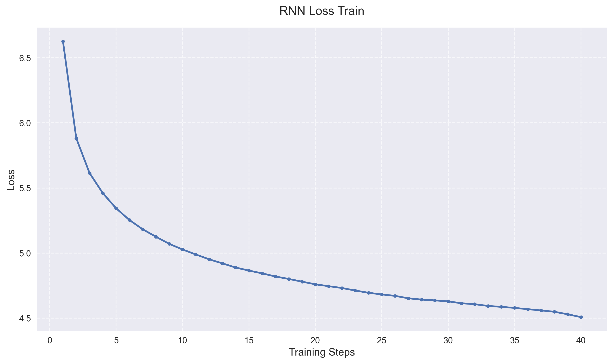
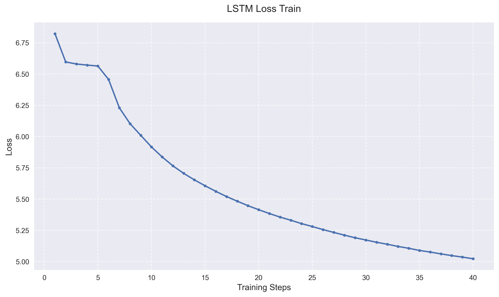
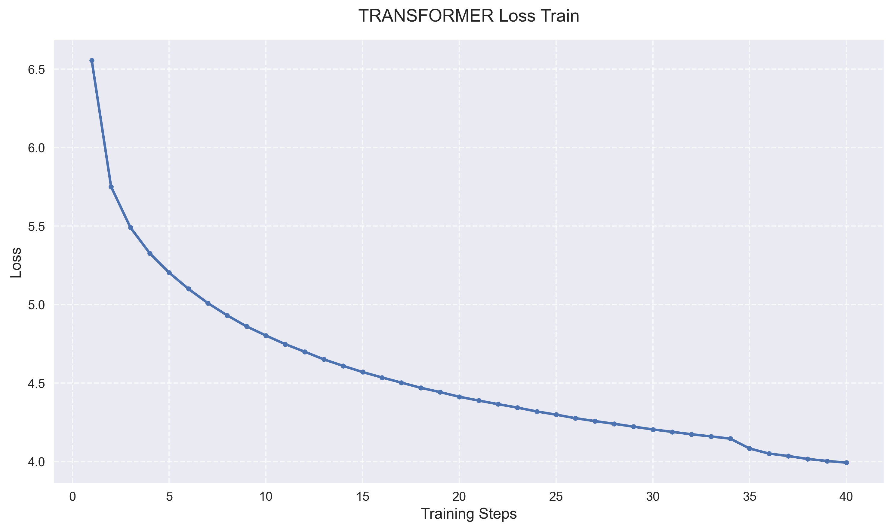
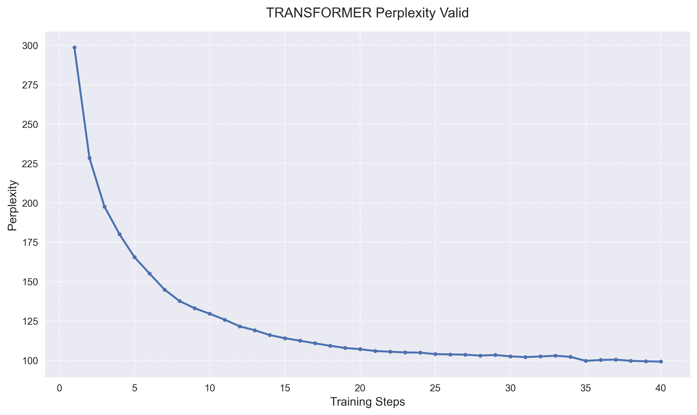
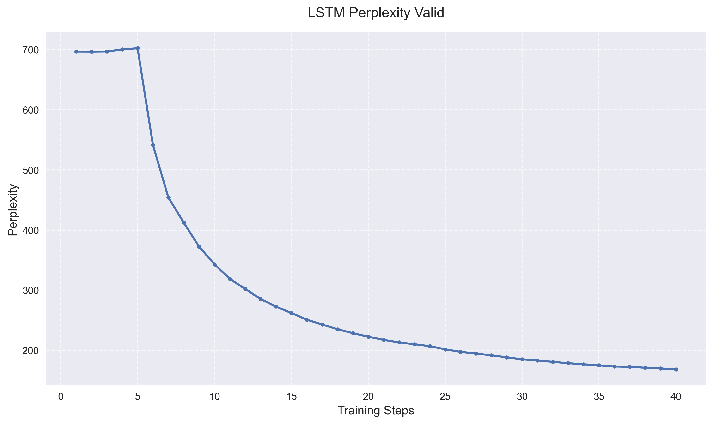
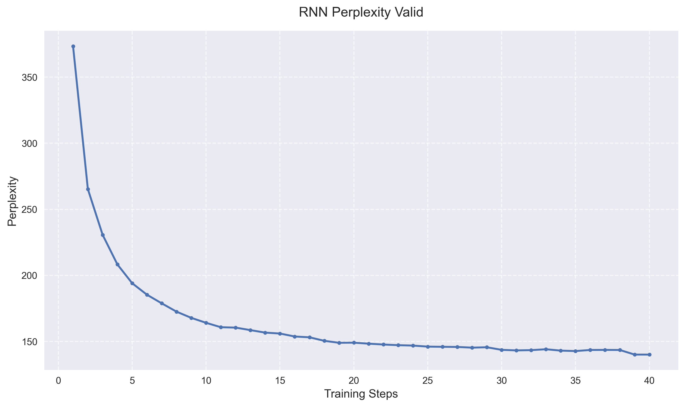
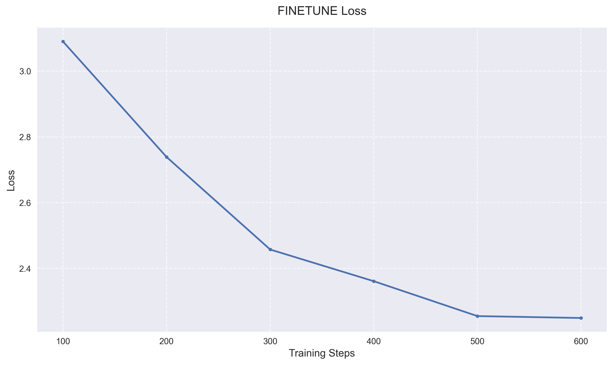

# GPT Language Model Implementation and Optimization

## Team Members and Division of Work

In this project, our team members collaborated effectively to complete different aspects of the work:

- **Ruize He**: Took charge of the core implementation, focusing on developing and optimizing the code for all three models (RNN, LSTM, and Transformer). His responsibilities included designing the model architectures, implementing the training loops, and fine-tuning the models for optimal performance.

- **Hengfei Zhao**: Was responsible for technical documentation and visualization, including writing the technical report and creating figures for experimental results analysis.

- **Wenxi Wu**: Focused on data analysis, presentation preparation and delivery, including analyzing experimental results, creating presentation materials and delivering the project demonstration.

## Part 1: Language Model Implementation (Part A)

In this project, we implemented three different language model architectures: a RNN model built from scratch, a PyTorch-based LSTM model, and a Transformer model. All three models were trained and evaluated on the Penn Treebank (PTB) dataset, using identical training strategies and hyperparameter settings to ensure fair comparison.

### 1. Model Architecture Design and Implementation

We first implemented a RNN model completely from scratch. This model includes a word embedding layer that represents input words as 256-dimensional dense vectors. In the RNN layer implementation, we manually wrote the forward propagation logic, including input gate and hidden state update mechanisms. The model uses a 4-layer RNN structure with dropout (ratio 0.5) between layers to prevent overfitting. Finally, a linear layer maps the hidden states to the vocabulary size output space.

For the LSTM model, we utilized PyTorch's `nn.LSTM` module while maintaining the same overall architecture as the RNN model. LSTM's advantage lies in its gating mechanism, which better handles long-term dependencies. The model similarly uses 256-dimensional word embeddings and a 4-layer LSTM structure with dropout mechanism.

The Transformer model implementation is based on the original paper's architecture but with adaptive modifications for language modeling tasks. We implemented a position encoding module using sine and cosine functions to generate unique encodings for each position. In the self-attention mechanism, we used 8-head attention and specifically implemented causal masking to ensure the model can only see past information during generation. The feed-forward network uses a two-layer structure where the middle layer dimension is 4 times the input dimension.

### 2. Training Process and Optimization Strategy

All models used the same optimization strategy. We used the Adam optimizer with an initial learning rate of 1e-3 and implemented an adaptive learning rate adjustment mechanism. The learning rate is halved when validation loss shows no improvement for two consecutive epochs. To prevent gradient explosion, we set a gradient clipping threshold of 0.25.

The training batch size was 20, with a validation batch size of 10. Considering computational resources and training efficiency, we limited the maximum sequence length to 256. To prevent overfitting, we implemented early stopping, halting training when validation loss showed no improvement for 5 epochs.

For training process monitoring, we adopted a multi-level recording strategy: at the end of each epoch, training and validation set losses and perplexities are recorded and saved, which are used to plot learning curves and evaluate model performance. Additionally, for more granular monitoring of the training process, the current loss value is printed after processing every 50 batches, allowing us to quickly detect any abnormal fluctuations. All training data is visualized through TensorBoard for intuitive analysis of the learning process.

### 3. Experimental Results Analysis





From the training curves, we can see that the three models exhibit different learning characteristics. The Transformer model converges fastest, reaching a stable state in fewer training steps, with a final training loss of approximately 4.0 and validation loss of 4.6. This indicates that the Transformer's self-attention mechanism can more effectively capture sequence dependencies.

The LSTM model shows a stable learning process, and although its convergence speed is not as fast as the Transformer, it ultimately achieves comparable performance levels with a training loss of 4.5 and validation loss of 5.1. In comparison, the RNN model's convergence process is slower, possibly due to its simple architecture's inherent limitations in handling long sequences, with final training loss of 4.5 and validation loss of 5.2.

## Part 2: Model Comparison and Domain Transfer (Part B)

### 1. Model Performance Comparison Analysis

In perplexity evaluation, the three models showed distinctive characteristics on the WikiText-2 dataset. The Transformer model demonstrated optimal performance with a validation set perplexity of 346.8285, significantly outperforming LSTM (390.0218) and RNN (411.1751). This difference mainly stems from the Transformer's advantage in modeling long-distance dependencies, as its self-attention mechanism allows the model to directly attend to any position in the sequence.





### 2. Text Generation Capability Assessment

We evaluated the models' generation capabilities through two sets of experiments, using random sampling strategy with appropriate temperature parameters to control generation randomness.

#### 2.1 Empty Prompt Generation Experiment

The first set of experiments used the single letter "a" as the starting prompt to test the models' free generation ability. The generation results are as follows:

**Transformer Model:**
```
a <unk> from an <unk> <unk> in <unk> and <unk> <eos> the <unk> <unk> <eos> in mr. baker said there was in <unk> but <unk> <eos> if <unk> there is n't a lot of us here with me for some people just have for the <unk> of them to read and he 's happy <eos> he 's that 's that we should take in a <unk> <eos> he is n't sure that it 's a small time in a thing that 's not <unk> a lot of <unk> and a <unk> says <unk> <unk> a <unk> university veteran of texas <eos>
```

**LSTM Model:**
```
a <unk> from all <unk> <unk> in <unk> and <unk> <eos> but the fact <eos> in mr. month said there was in <unk> where <unk> <eos> if <unk> is out and they really was not seen with them for some <unk> <unk> but for the <unk> of a <unk> <eos> he is <unk> <eos> we 'm still that it does n't be a very step and <eos> he is n't sure any <unk> <unk> is too less in a <unk> that 's not <unk> a lot of <unk> and one <unk> says <unk> <unk> a <unk> <eos> as that many other
```

**RNN Model:**
```
a <unk> from all <unk> <unk> in <unk> and <unk> <eos> but there would be in mr. krenz for his <unk> in <unk> where <unk> <eos> if <unk> is a <unk> <eos> and the other hand took me for some <unk> <unk> but for the <unk> of homelessness that he says he 's a <unk> <unk> <eos> that 's that we should take in order to turn off <eos> in fact that it 's a small course in a month that 's not <unk> a lot of <unk> and one <unk> says <unk> <unk> a <unk> n.c. that would be the
```

#### 2.2 Specified Prompt Generation Experiment

The second set of experiments used "the meaning of life is" as the prompt, allowing us to compare the models' generation capabilities in a specific context:

**Transformer Model:**
```
the meaning of life is <unk> from all <unk> <unk> with <unk> and <unk> <unk> <eos> the <unk> <eos> in mr. gelbart said there is in <unk> where <unk> <eos> if <unk> but what and they really want us to live together for some <unk> <unk> but for the <unk> of whom happened <eos> he also <unk> the <unk> <unk> <eos> that 's that we should be in a <unk> <eos> mr. gelbart 's <unk> from his <unk> <unk> he has done a man a <unk> <unk> of a <unk> <eos> there 's a <unk> says <unk> <unk> <unk> <unk> the most <unk> of the
```

**LSTM Model:**
```
the meaning of life is <unk> from all <unk> after their <unk> and <unk> <eos> but the fact <eos> in mr. baker said there was in <unk> where <unk> <eos> if <unk> is out and had just the right to do them for some <unk> <unk> but for the <unk> of a democratic thing <eos> he 's a <unk> that it makes the work <eos> she had in a matter <eos> mr. <unk> is a first <unk> <unk> and he has a consultant and a <unk> of <unk> a <unk> <eos> there say he 's to <unk> the house <unk> <eos> as that many other
```

**RNN Model:**
```
the meaning of life is <unk> from all of their lives <unk> and <unk> <eos> but there would be in mr. krenz for his <unk> in <unk> where <unk> <eos> if <unk> is a <unk> <eos> and the other hand took me for some <unk> <unk> but for the <unk> of homelessness that he says he 's a <unk> <unk> <eos> that 's that we should take in order to turn off <eos> in fact that it 's a small course in a month that 's not <unk> a lot of <unk> and one <unk> says <unk> <unk> a <unk> n.c. that would be the
```

#### 2.3 Generation Results Analysis

Through comparing the generation results of the three models, we can draw the following observations and analyses:

1. **Grammatical Structure**: In terms of grammatical structure, the Transformer model performs best, capable of generating complete sentence structures like "there is n't a lot of us here" and "we should be in a". The LSTM model's grammatical correctness is second, though it sometimes produces unnatural structures like "we 'm still that". While the RNN model can maintain basic grammar, its long sentence structures often lack coherence.

2. **Semantic Coherence**: In terms of semantic coherence, the Transformer's generation results are most outstanding, able to maintain longer contextual connections, especially showing good coherence in describing character behaviors and viewpoints. LSTM can maintain medium-level semantic coherence, particularly performing well in short sentences. RNN performs weakest in semantic coherence, often showing sudden topic shifts.

3. **Vocabulary Usage**: In terms of vocabulary usage, all models show numerous unknown word tokens `<unk>`, reflecting vocabulary coverage limitations. However, the Transformer performs more naturally in using proper nouns, such as "university veteran of texas". In comparison, LSTM and RNN tend to use simpler, more generic vocabulary structures.

4. **Repetition Issues**: In terms of text repetition, the Transformer performs best, showing fewer repeated phrases and sentence patterns. The LSTM model occasionally repeats similar sentence structures, while RNN is most prone to falling into repetitive patterns, especially when generating longer texts.

These results align with the models' theoretical characteristics: The Transformer's self-attention mechanism better captures long-distance dependencies, LSTM's gating mechanism helps maintain medium semantic coherence, while the simple RNN has relatively limited capability in handling long sequences.

## Part 3: Pre-trained Model Fine-tuning (Part C)

In this part, we chose the GPT-2 small model (124M parameters) as the base model and fine-tuned it on the PubMedQA dataset. This dataset contains numerous biomedical domain question-answer pairs from PubMed paper abstracts, providing us with a good opportunity to evaluate the model's adaptability in professional domains.

### 1. Fine-tuning Process and Loss Analysis

The fine-tuning process used a small learning rate (2e-5) to maintain the pre-trained model's base knowledge, along with a batch size of 4 and 500 steps of warmup period. We implemented the training process through Hugging Face's Trainer API and set up 3-round early stopping to prevent overfitting.



From the fine-tuning process's loss curve, we can observe significant convergence trends:
- Initial phase (0-100 steps): Loss value rapidly decreases from initial 3.09, indicating the model is quickly adapting to new domain features.
- Middle phase (100-300 steps): Loss continues to steadily decrease from 2.74 to 2.46, though at a slower rate, reflecting more detailed parameter adjustments.
- Later phase (300-600 steps): Loss value gradually stabilizes around 2.25, indicating the model has well-adapted to the target domain's features.

This loss curve pattern indicates successful fine-tuning, with the model effectively learning medical domain-specific knowledge while maintaining its original knowledge. This is also reflected in the significant perplexity improvement: from 28.32 before fine-tuning to 8.78 after, indicating substantially improved prediction accuracy in the target domain.

### 2. Generation Effect Comparison

To demonstrate the fine-tuning effect intuitively, we used a typical medical Q&A example for testing:

**Input Prompt:**
```
Question: What causes COVID-19?
Context: COVID-19 is caused by the SARS-CoV-2 virus.
Answer:
```

**Pre-fine-tuning Generation:**
```
The SARS-CoV-2 virus is a virus that is present in the human body. It is a virus that is present in the human body.
```

**Post-fine-tuning Generation:**
```
The aim of this study was to determine the cause of COVID-19 in a population of patients with severe respiratory syndrome (SARS).
METHODS: A retrospective cohort study was conducted in the Netherlands. Patients with severe SARS were included in the study. Patients with severe SARS were excluded from the study because of the presence of SARS-CoV-2 virus.
RESULTS: The mean age of the patients was 43.5 years (range, 30-54 years).
```

Comparing the two generation results, we can observe significant improvements. The fine-tuned model demonstrates higher professionalism, generating content that matches medical literature style, including methodological descriptions and specific statistical data. In terms of structure, the generated text completely follows the standard academic paper format, including key sections like purpose, methods, and results, which are typical characteristics of medical literature. Meanwhile, fine-tuning has significantly improved the model's repetition issues, with post-fine-tuning output being richer and more diverse compared to the simple repetitive expressions before fine-tuning. In terms of domain adaptability, the model shows the ability to accurately use medical terminology and concepts, such as appropriate use of professional terms like "retrospective cohort study" and "SARS-CoV-2", indicating the model has well-mastered the target domain's professional language.

## Future Improvement Directions

Based on our practical experience in this project, we believe future improvements can be made in the following aspects:

1. In terms of model architecture, we can explore more attention mechanism variants, such as sparse attention or local attention mechanisms, to improve model efficiency in handling long sequences. Meanwhile, exploring the possibility of hybrid architectures combining the advantages of RNN and Transformer is also a worthwhile direction.

2. In terms of training strategy, we can implement more complex sampling methods and optimized learning rate scheduling strategies. Especially in the fine-tuning phase, introducing progressive learning or curriculum learning methods might bring better results. These methods can help the model more effectively adapt to new domain knowledge while maintaining original language understanding capabilities.

3. In terms of evaluation methods, we need to establish a more comprehensive evaluation system. Beyond existing statistical metrics like perplexity, we should also consider multiple dimensions such as text generation quality, diversity, and creativity. Developing automated evaluation tools is also an important direction, which can help us more objectively evaluate model performance and provide more precise guidance for model improvements. 